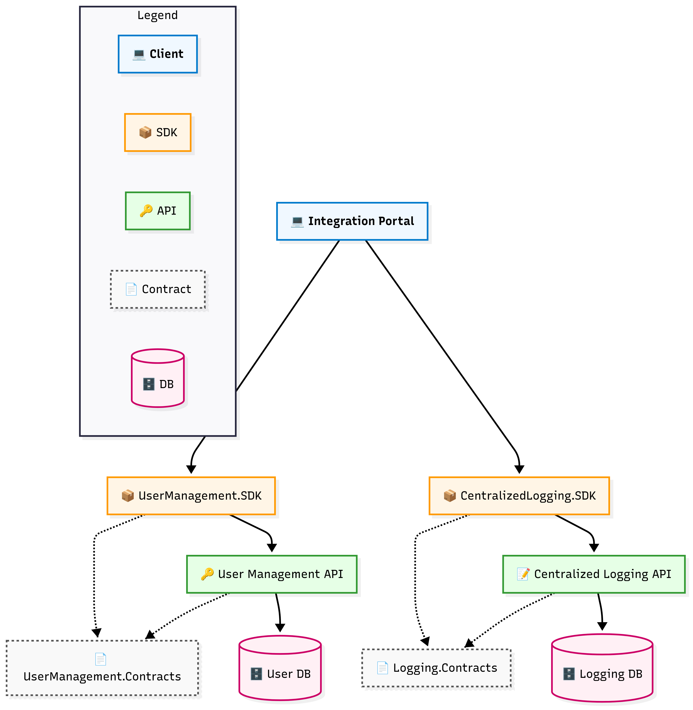
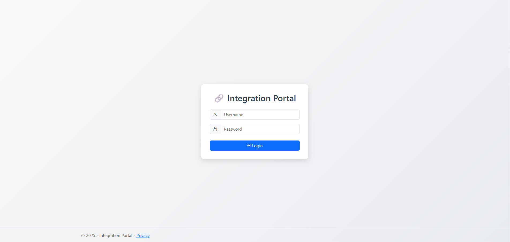
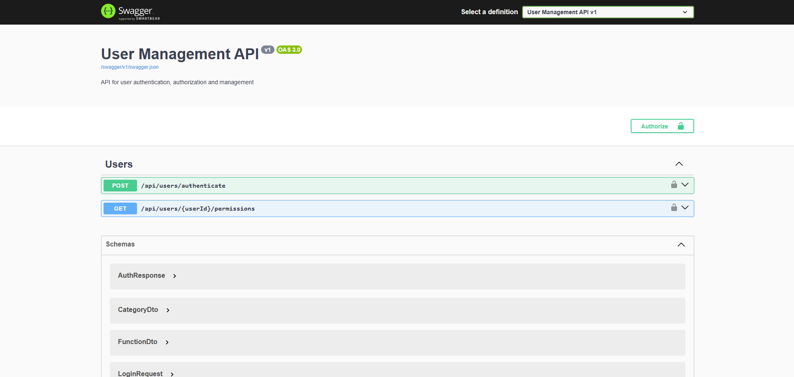
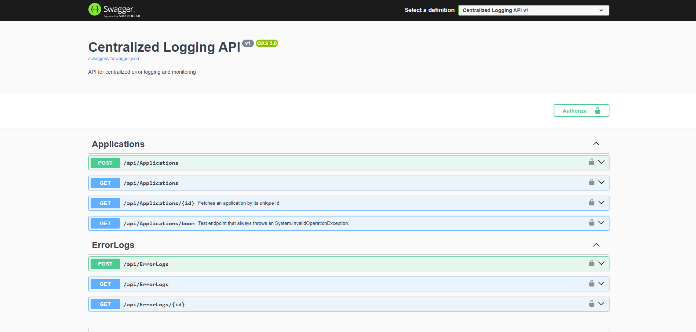

# Centralized Logging & Monitoring API

A centralized error logging and monitoring API built with **.NET 9**, Entity Framework Core, and SQL Server. This project is designed to serve as a foundation for collecting, storing, and managing error logs from multiple applications. **Phase 5,7&8** have also been complated and the pending **Phase 6** will be developed in a new repository. 

Each phase of development is preserved in its own branch, culminating in the final **Integration Portal,** which, together with the API projects, forms a **Microservices-inspired architechture** that demonstrates **the Single Service Database Pattern.**

---

## 🖥️ Integration Portal

## 🌟 What It Is

A **.NET 9 MVC Web App** that unifies multiple APIs (**User Management and Logging**) into a single **Integration Portal** with **role-based navigation**.

---

## ⚙️ Implementation Details

- **Login & Validation**
  
  - Custom login (no ASP.NET Core Identity).
  
  - **Client-side validation** with jQuery Validation + Bootstrap feedback.
  
  - **Server-side validation** ensures username/password check against database seeded users.
  
  - Bearer handler implemented that fetches token from Memory cache on every request
  
  - Areas implemented

- **Users & Roles (Alice / Bob)**
  
  - User credentials (`alice/alice`, `bob/bob`) seeded in DB/EF Core migration for demo.
  
  - **Alice (Admin)** → sees *Logs* link enabled.
  
  - **Bob (Operations)** → restricted, no access to logs.
  
  - Role checks handled through **claims in JWT**.
  
  - JWT is stored **in-memory cache**

- **Serilog Logging (Web App)**
  
  - Web App configured with **Serilog file sinks** (`/logs/dev-app-.log`).
  
  - Request Audibility and Exception handling middleware added in APIs
  
  - Structured logs include **timestamp, environment, service name, correlation ID**.

- **Error Logging API Integration**
  
  - On invalid login → error posted to **Error Logging API** via secured HTTP client.
  
  - Uses **Polly retry policy** for resilience.
  
  - API persists errors to DB + local log file (from Phase 3).

- **Dynamic Sidebar Category Tree**
  
  - After login → Web App queries **User Management API** for role/category/module/functions.
  
  - Sidebar navigation auto-adjust per user role.

- **Logs Link (Working Feature)**
  
  - Clicking *Logs* fetches data from the **Centralized Logging API** (Phase 1).
  
  - Admin users can view structured logs with pagination (DataTables).
  
  - Non-admins only see authorized links.

- **Logout & Session Handling**
  
  - Logout clears JWT/session cache.
  
  - User redirected back to login page.
  
  - Ensures secure re-authentication before accessing APIs again.

--- 

## 📊 Architecture Glimpse

  
<sub>[View Mermaid source](docs/integration_portal_architecture.mmd)</sub>

---

### 📸 Screenshots

### 🔑 Login Page



### 📂 Home & Sidebar


### 📊 Logs (Admin View)


## 📡 API Swagger UI

**User Management API**



**Centralized Error Logging API**



---

## 🏗️ Planned Enhancements (Next Repository)


The next repository will focus on:

- **Centralized Authorization Layer/Handler**
  
  - Area/Controller/Action logic stored in DB.
  
  - Raised to in-memory cache for performance.
  
  - Shared **distributed cache layer** (Dragonfly/Redis).

- **Cross-API Authorization Consistency**
  
  - One source of truth for both Web App + APIs.
  
  - Cache synchronization across services.

---

## 📂 Project Structure

```bash
IntegrationPortal/
 ├── Areas/
 │ ├── User/ # User-related features
 │ │ ├── Controllers/ # Controllers for User area
 │ │ ├── Models/ # EF Core models
 │ │ └── Views/ # Razor views
 │ ├── Admin/ # Admin-related features
 │ │ ├── Controllers/
 │ │ ├── Models/
 │ │ └── Views/
 │ └── ... # Other areas (modules, roles, etc.)
 ├── Services/ # Shared services & API clients
 ├── wwwroot/ # Static assets (CSS, JS, icons)
 ├── appsettings.json # Config (logging, connection, JWT)
 ├── docs/
 │ └── integration_portal_architecture.png
 │ └── integration_portal_architecture.mmd
 └── README.md # Documentation
```

---

## ⚙️ Environments

The project supports multiple environments:

- **Development**
  
  - Connection string uses local SQL Server (LocalDB).
  - Loaded from `appsettings.Development.json`.

- **Production**
  
  - Connection string points to Docker SQL Server.
  
  - Loaded from `appsettings.Production.json`.
  
  - Environment set via:
    
    ```bash
    ASPNETCORE_ENVIRONMENT=Production
    ```

---

## 🖥️ Running with Visual Studio (Development)

Open CentralizedLoggingMonitoring.sln in Visual Studio.

Press F5 or run the project.

By default, it uses Development environment with appsettings.Development.json.

---

## 📦 Running with Docker (Production)

- **Build and start the containers**
  
  - docker-compose up --build

- **Stop the containers**
  
  - docker-compose down

The API will be available at:

HTTP → http://localhost:5000/api

(HTTPS optional, future phase)

---

## 📈 Future Enhancements

## 🐛 Phase 6: Info Express API with Client

- Add SQL and SQL count in database of a report ABC
- Add Parameter JSON in database of a report ABC
- Add Datatable Header JSON in database of a report ABC 
- Update Seed Data
- Create a form ABC to search and download without writing code

**This will be developed as a new repository.**

---

## 📬 Sample API Requests

Create Application

```bash
http POST /api/Applications
Content-Type: application/json

{
  "name": "Payment Service",
  "environment": "Production"
}
```

Create Error Log

```bash
http POST /api/ErrorLogs
Content-Type: application/json

{
  "applicationId": 1,
  "severity": "Error",
  "message": "Null reference exception in payment processing",
  "stackTrace": "at PaymentService.Process()...",
  "source": "PaymentService",
  "userId": "user123",
  "requestId": "req-456"
}
```

---

## 🤝 Contributing

Future phases will be added in branches (phase-2, phase-3, …).
Main branch will always contain the latest stable version.

Contributions are welcome — whether bug fixes, feature enhancements, or discussions about **authorization best practices**.

---

## 📂 Repository Roadmap

```bash
phase-1-core-api → Completed Phase 1.
phase-2-logging → Planned logging integration.
phase-3-um-api → Planned API documentation.
main → Always up to date with the latest stable phase.
```

---

## 📜 License

This project is licensed under the MIT License.

---
